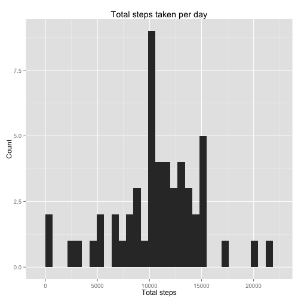

# Reproducible Research: Peer Assessment 1


## Loading and preprocessing the data


```r
library(ggplot2)
library(lubridate)
activity <- read.csv("activity.csv")
summary(activity)
```

```
##      steps               date          interval   
##  Min.   :  0.0   2012-10-01:  288   Min.   :   0  
##  1st Qu.:  0.0   2012-10-02:  288   1st Qu.: 589  
##  Median :  0.0   2012-10-03:  288   Median :1178  
##  Mean   : 37.4   2012-10-04:  288   Mean   :1178  
##  3rd Qu.: 12.0   2012-10-05:  288   3rd Qu.:1766  
##  Max.   :806.0   2012-10-06:  288   Max.   :2355  
##  NA's   :2304    (Other)   :15840
```

```r
activity$date = as.Date(activity$date)
unique(activity$date)
```

```
##  [1] "2012-10-01" "2012-10-02" "2012-10-03" "2012-10-04" "2012-10-05"
##  [6] "2012-10-06" "2012-10-07" "2012-10-08" "2012-10-09" "2012-10-10"
## [11] "2012-10-11" "2012-10-12" "2012-10-13" "2012-10-14" "2012-10-15"
## [16] "2012-10-16" "2012-10-17" "2012-10-18" "2012-10-19" "2012-10-20"
## [21] "2012-10-21" "2012-10-22" "2012-10-23" "2012-10-24" "2012-10-25"
## [26] "2012-10-26" "2012-10-27" "2012-10-28" "2012-10-29" "2012-10-30"
## [31] "2012-10-31" "2012-11-01" "2012-11-02" "2012-11-03" "2012-11-04"
## [36] "2012-11-05" "2012-11-06" "2012-11-07" "2012-11-08" "2012-11-09"
## [41] "2012-11-10" "2012-11-11" "2012-11-12" "2012-11-13" "2012-11-14"
## [46] "2012-11-15" "2012-11-16" "2012-11-17" "2012-11-18" "2012-11-19"
## [51] "2012-11-20" "2012-11-21" "2012-11-22" "2012-11-23" "2012-11-24"
## [56] "2012-11-25" "2012-11-26" "2012-11-27" "2012-11-28" "2012-11-29"
## [61] "2012-11-30"
```


## What is mean total number of steps taken per day?


```r
tot_steps <- tapply(activity$steps, activity$date, sum)
qplot(tot_steps, main = "Total steps taken per day", xlab = "Total steps", ylab = "Count", 
    margins = T)
```

```
## stat_bin: binwidth defaulted to range/30. Use 'binwidth = x' to adjust this.
```

 

```r

## calculate the mean and median total number of steps taken per day
act_mean <- mean(tapply(activity$steps, activity$date, sum), na.rm = TRUE)
act_median <- median(tapply(activity$steps, activity$date, sum), na.rm = TRUE)
act_mean
```

```
## [1] 10766
```

```r
act_median
```

```
## [1] 10765
```

```r
## mean is 10766.19, median is 10765
```


## What is the average daily activity pattern?


```r
intervals <- unique(activity$interval)
avgsteps <- tapply(activity$steps, activity$interval, mean, na.rm = T)
interval_data <- data.frame(intervals, avgsteps)
with(interval_data, plot(intervals, avgsteps, main = "Average daily steps per interval", 
    ylab = "average steps", type = "l"))
```

 

```r
max_index <- as.numeric(which.max(interval_data$avgsteps))
interval_data[max_index, ]
```

```
##     intervals avgsteps
## 835       835    206.2
```

```r
## the 835 interval has the most with 206 steps
```


## Imputing missing values

First calulating the total number of NAs:

```r
table(is.na(activity$steps))
```

```
## 
## FALSE  TRUE 
## 15264  2304
```


For missing values, replacing them with the mean at that same interval, as I am assuming that activities follow a daily pattern.

```r
steps_per <- aggregate(activity$steps, by = list(interval = activity$interval), 
    mean, na.rm = T)
# convert to integers for plotting
steps_per$interval <- as.integer(levels(steps_per$interval)[steps_per$interval])
```

```
## Error: replacement has 0 rows, data has 288
```

```r
colnames(steps_per) <- c("interval", "steps")

means_replace <- function(activity, defaults) {
    na_indices <- which(is.na(activity$steps))
    defaults <- steps_per
    na_repl <- unlist(lapply(na_indices, FUN = function(ind) {
        interval = activity[ind, ]$interval
        defaults[defaults$interval == interval, ]$steps
    }))
    new_steps <- activity$steps
    new_steps[na_indices] <- na_repl
    new_steps
}
activity_imp <- data.frame(steps = means_replace(activity, avgsteps), date = activity$date, 
    interval = activity$interval)

summary(activity_imp)
```

```
##      steps            date               interval   
##  Min.   :  0.0   Min.   :2012-10-01   Min.   :   0  
##  1st Qu.:  0.0   1st Qu.:2012-10-16   1st Qu.: 589  
##  Median :  0.0   Median :2012-10-31   Median :1178  
##  Mean   : 37.4   Mean   :2012-10-31   Mean   :1178  
##  3rd Qu.: 27.0   3rd Qu.:2012-11-15   3rd Qu.:1766  
##  Max.   :806.0   Max.   :2012-11-30   Max.   :2355
```


Plotting new dataset with inserted steps:

```r
intervals <- unique(activity_imp$interval)
avgsteps <- tapply(activity_imp$steps, activity_imp$interval, mean, na.rm = T)
interval_data_imp <- data.frame(intervals, avgsteps)
with(interval_data_imp, plot(intervals, avgsteps, main = "Average daily steps per interval", 
    ylab = "average steps", type = "l"))
```

 


Calculating the new mean and median

```r
imp_mean <- mean(tapply(activity_imp$steps, activity_imp$date, sum), na.rm = TRUE)
imp_median <- median(tapply(activity_imp$steps, activity_imp$date, sum), na.rm = TRUE)
imp_mean
```

```
## [1] 10766
```

```r
imp_median
```

```
## [1] 10766
```

